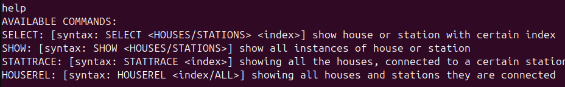
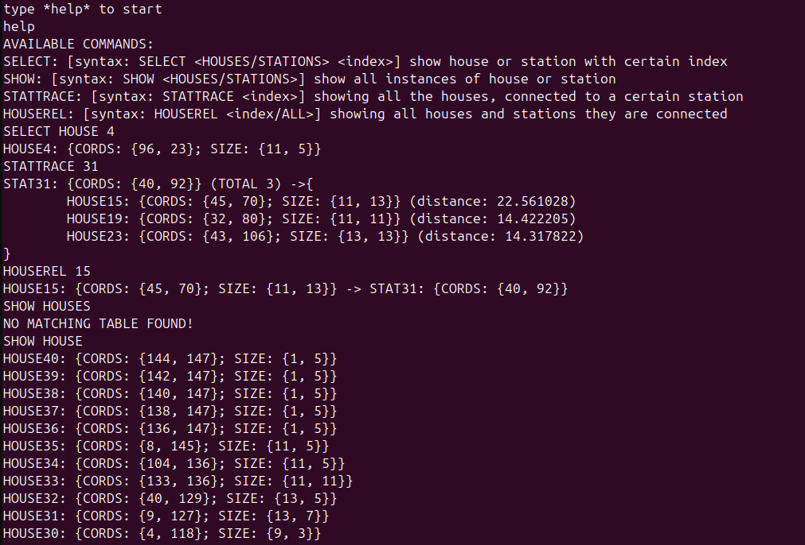
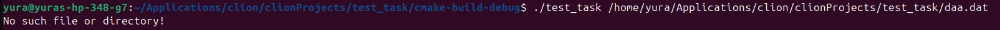
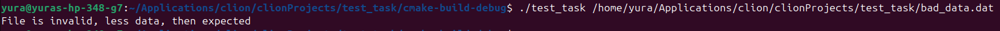

## Общее описание решения

В данном репозитории есть три ветки:

1.master - решение с большим упором на структуру и расширяемость

2.[cool_mode_for_console](https://github.com/tinunadno/test_task/tree/cool_mode_for_console) - то-же решение, что и в master, но с более комплексным консольным интерфейсом

3.[simple_solution](https://github.com/tinunadno/test_task/tree/simple_solution) - максимально простое и последовательное решение, где реализация максимально соответствует ТЗ

*описание непосредственно алгоритма и оценки его сложности я приложил в ветке [simple_solution](https://github.com/tinunadno/test_task/tree/simple_solution)*

## Описание задания

На вход подается файл с картой некоторых объектов двух типов, объекты первого типа могут быть произвольного размера, второго только 1 на 1 клетку

Требуется сконструировать ассоциативную структуру, где каждому объекту второго типа сопоставляется множество объектов первого типа

Сопоставление объектов происходит следующим образом:

Каждому объекту первого типа сопоставляется ближайший объект второго типа

И для каждого объекта второго типа требуется агрегировать все соответствующие объекты первого типа

После создания требуемой структуры требуется предоставить пользователю консольный интерфейс, где по имени второго объекта можно получить все соответствующие объекты первого типа и их расстояния

## Описание решения

### Общее описание решения в master

Как уже было упомянуто в общем описании в этой ветке находится решение с большим упором на общую структуру

В этом решении я реализовал паттерн Pipeline, так как обработка исходного файла осуществляется последовательно, то 
саму обработку можно собрать из отдельных модулей (например читать исходный файл, распарсить, вывести),
и можно очень удобно менять pipelin'ы в зависимости например от типа файла.
И при такой реализации можно максимально легко изменять, или заменять отдельные блоки обработки, не заботясь о реализации остальных

### Описание реализации master

Всю логику обработки я объединил в общий **namespace map_processing**, и его разбил на namespac'ы основных этапов обработки так, что бы из блоков можно было собрать нужный pipeline

Вся обработка (от чтения до интерфейса) происходит в **namespace pipeline**

```c++
    namespace pipeline {
        using processing_types::TextData;
        using namespace IO;
        using namespace UI;
        using namespace processing_core;
        using namespace tiny_database;

        class PipeLine {
        public:
            explicit PipeLine(const vector<shared_ptr<DataProcessor>> &dp, shared_ptr<FinalProcessingUnit> &pl_ending)
                    : processors(dp), pipe_line_ending(pl_ending) {}

            void initiate_pipe_line(const shared_ptr<ProcessingData> &init_data) {
                shared_ptr<ProcessingData> last_return = init_data;
                while (true) {
                    try {
                        last_return = this->process_next(last_return);
                        if (last_return == nullptr) {
                            break;
                        }
                    } catch (ProcessingDataTypeMissmatch &e) {
                        cout << e.what();
                    } catch (ProcessingException &e) {
                        cout << e.what();
                    }
                }
            }

            shared_ptr<ProcessingData> process_next(shared_ptr<ProcessingData> &pd) {
                if (pipe_line_counter < processors.size()) {
                    return (processors[pipe_line_counter++])->process(pd);
                }
                pipe_line_ending->process(pd);
                return nullptr;
            }

        private:
            vector<shared_ptr<DataProcessor>> processors;
            shared_ptr<FinalProcessingUnit> pipe_line_ending;
            size_t pipe_line_counter = 0;
        };

        void start_map_processing(string &file_name) {
            auto td = make_shared<TextData>();
            td->text = file_name;
            vector<shared_ptr<DataProcessor>> pd = {
                    make_shared<ReadFile>(),
                    make_shared<HousesStationTracer>(),
                    make_shared<HouseStationSetProcessor>()
            };
            auto concole_UI = dynamic_pointer_cast<FinalProcessingUnit>(make_shared<ConsoleUI>());
            auto pl = new PipeLine(pd, concole_UI);
            pl->initiate_pipe_line(td);
            delete pl;
        }
    }
```

*При этом и сам PipeLine можно менять под конкретные нужды*

Также стоит отметить, что если например pipeline создан не верно, или при обработке возникли какие-то ошибки, то класс Pipeline сообщит об этом пользователю и завершит работу

Тут класс PipeLine принимает вектор из обработчиков, наследующих абстрактный класс, и имплементирующих process

```c++
    class DataProcessor {
    public:
        DataProcessor() = default;

        virtual shared_ptr<ProcessingData> process(shared_ptr<ProcessingData>) = 0;

        virtual ~DataProcessor() = default;
    };
```

process принимает классы, наследующиеся от абстрактного класса обрабатываемых данных
 
```c++
    class ProcessingData {
    public:
        virtual ~ProcessingData() = default;
    };
```

А при завершении pipelin'а итоговые обработанные данные передаются в класс, наследующийся от FinalProcessingUnit, который принимает данные и ничего не возвращает

```c++
    class FinalProcessingUnit {
    public:
        virtual void process(shared_ptr<ProcessingData>) = 0;

        virtual ~FinalProcessingUnit() = default;
    };
```

В данной конкретной реализации FinalProcessingUnit - это консольный интерфейс, который принимает обработанные данные и отвечает за взаимодействие с пользователем

### Описание конкретного кейса обработки данных

В функции **start_map_processing** происходит сборка pipelin'а и его запуск, для данного задания pipeline состоит из 

ReadFile - читает исходный бинарный файл в vector<vector<uchar>> и передает его следующему блоку обработки

HouseStationTracer - парсит исходный преобразованный в вектор файл в отельные вектора для объектов первого и второго типа

HouseStationSetProcessor - преобразовывает полученные вектора в класс HouseStationTabel

```c++
        class HouseStationTable : public ProcessingData {
        public:
            unordered_map<size_t, size_t> house_station_table;
            unordered_map<size_t, House> house_table;
            unordered_map<size_t, Station> station_table;
        };
```

И тут может появиться справедливое замечание про то, что станции и дома сопоставляются не самым оптимальным способом. Это обусловлено тем, что данная реализация больше нацелена на общую структуру и при желании можно легко взять функцию из ветки simple_solution_branch, где сопоставление происходит более оптимальным образом и вставить в pipeline обработки

#### консольный интерфейс

Я реализовал 4 типа команд:



Их реализация ложится на класс **CommandProcessor** в **namespace tiny_database** он реализует максимально минималистичную и упрощенную мини бд в которой храниться только две таблицы (и реализован немножко коряво, я уже был уставшим на тот момент).
В функции process_command он принимает запрос пользователя, определяет тип команды, парсит ее и возвращает обработанный ответ. Именно для класса CommandProcessor и был сконструирован класс HouseStationTable, который как бы имитирует таблицы со ссылками друг на друга.
И так как никакой пред-обработки для этих таблиц не предусматривается, то он кэширует уже обработанные запросы в удобном для него формате

**И непосредственно консольный интерфейс**

Класс **ConsoleUI** по сути отвечает только за HELP и EXIT а остальное передает на обработку CommandProcessor'у

## Примеры работы

### Базовый случай



### Пример ошибки во время обработки

*нету нужного файла*



*битый бинарный файл*

